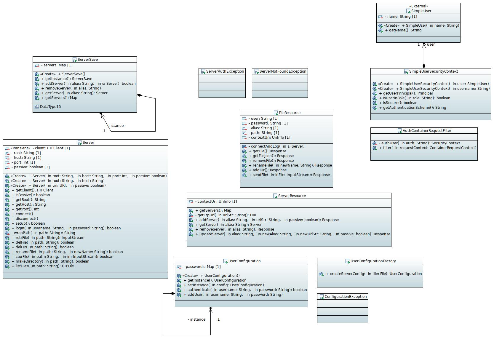

# FTP Flopbox

### Auteur : Enzo Pain

### Date : 21/03/22

## Introduction

Projet de service REST permettant d'accéder à plusieurs serveurs FTP et de les gérer.

## Utilisation

### Compilation

Pour générer le JAR du serveur ainsi qu'une racine et configuration d'exemple :

	mvn package
	
Pour la javadoc utilisez la commande suivante :

	mvn javadoc:javadoc
	
Elle sera ensuite disponible ici : target/site/apidocs/index.html

### Exécution

Le serveur http avec le service REST est exécutable dans un terminal :

	java -jar target/flopbox-1.0-jar-with-dependencies.jar USERCONF
	
Par exemple, après un `mvn package` une configuration d'exemple peu être utilisée ainsi :

	java -jar target/flopbox-1.0-jar-with-dependencies.jar target/classes/users.conf
	
### Configuration

Le fichier de configuration donné en paramètre permet de spécifier les utilisateurs du serveur ainsi que leur mot de passe.  
Le fichier contient un utilisateur par ligne selon le format :

	nom_d'utilisateur   mot_de_passe 
	
## Architecture

Deux resources principales forment le service :

- FileResource: Resource représentant un fichiers sur un serveur FTP de la plateforme.
- ServerResource: Resource représentant un serveur FTP.

### Fichiers

`/{name}/{path}` est le chemin d'une FileResource :
- POST: Permet de créer un fichier au chemin `path` dans le serveur ftp avec comme alias `name`.  
Selon le type de donnée envoyée le fichier crée peut être un répertoire(pas de type ou text/plain) ou un fichier regulier(application/octet-stream).
- PUT: Permet de renomer un fichier au chemin `path` dans le serveur ftp avec comme alias `name`.  
Le nouveau nom du fichier doit être donnée dans le paramètre `newName` du corps HTTP.
- DELETE: Permet de supprimer un ficher au chemin `path` dans le serveur ftp avec comme alias `name`.
- GET: Permet de télécharger un fichier ou d'en récupérer les informations selon le type de donnée accepté.
application/json permet de récupérer les infos du fichier ou le contenu du répertoire.
application/octet-stream permet de récupérer le fichier en lui même.

### Authentification

L'authentification à un serveur ftp se fait lors de l'accès à une FileResource via les deux headers HTTP `X-Ftp-Username` et `X-Ftp-Password`.

## Code Samples

Utilisation des stream pour traduire les fichiers en lien du service REST.

	FTPFile[] files = s.listFiles(path);
			
	Stream<FTPFile> filesStream = Arrays.stream(files);
	return Response.ok(
			filesStream.map( f -> {
				URI fileUri;
				try {
					fileUri = URI.create(contextUri.getRequestUri() + "/" + URLEncoder.encode(f.getName(), "UTF-8"));
				} catch (UnsupportedEncodingException e) {
					e.printStackTrace();
					throw new ServerErrorException(500);
				}
				return Json.createObjectBuilder()
						.add("link", fileUri.toString())
						.add("type", f.getType() == FTPFile.FILE_TYPE ? "application/octet-stream" : "application/json")
						.build();
			}).toArray()).build();

Filtrage pour l'authentification des utilisateurs.

	public void filter(ContainerRequestContext requestContext) {
		String auth = requestContext.getHeaderString("Authorization");
		try {
			requestContext.setSecurityContext(authUser(auth));
		} catch (AuthenticationException e) {
			Response unauth = Response
					.status(Status.UNAUTHORIZED)
					.header("WWW-Authenticate", "Basic realm=\"flopbox\"")
					.build();
			requestContext.abortWith(unauth);
		}
	}
